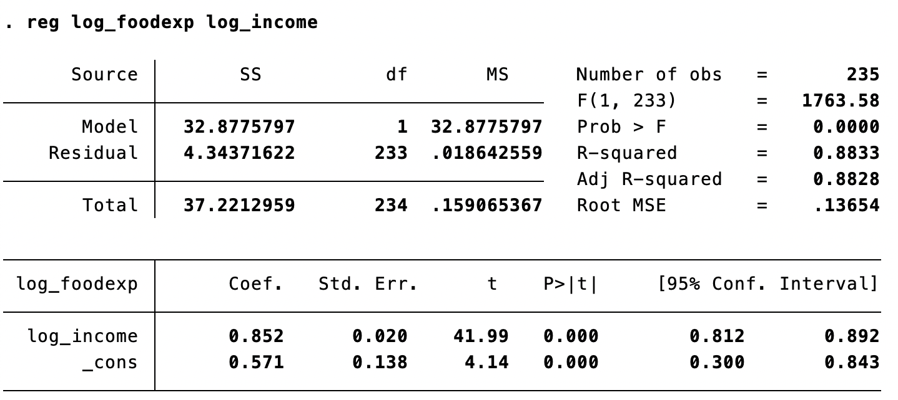
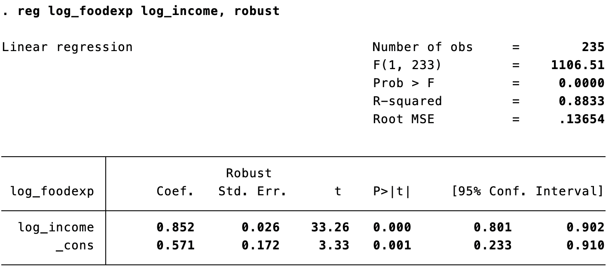

# Q1

WTS: Optimal value of $\gamma^*$ that minimizes the Mean Squared Error (MSE) for the "two-sided" density estimator and compare convergence rates to the "one-sided" estimator.

1. Bias of the estimator:
   - $Bias(\hat{f}_n) = E[\hat{f}_n(x)] - f(x)$
   - Using Taylor expansion of $f(x)$ around $x$:
     - $E[\hat{F}(x + h/2)] \approx F(x) + \frac{h}{2}f(x) + O(h^2)$
     - $E[\hat{F}(x - h/2)] \approx F(x) - \frac{h}{2}f(x) + O(h^2)$
   - Therefore, $Bias(\hat{f}_n) \approx O(h^2)$

2. Variance of the estimator:
   - $Var(\hat{f}_n) = E[(\hat{f}_n(x) - E[\hat{f}_n(x)])^2]$
   - Since $\hat{F}(x)$ is the empirical cdf, $Var(\hat{F}(x)) = \frac{F(x)(1-F(x))}{N}$
   - Therefore, $Var(\hat{f}_n) = \frac{1}{Nh}O(1)$

Combining bias and variance for MSE:
- $MSE(\hat{f}_n) = Bias(\hat{f}_n)^2 + Var(\hat{f}_n)$
- $MSE(\hat{f}_n) \approx O(h^4) + \frac{1}{Nh}O(1)$
- To minimize MSE, differentiate w.r.t. $h$ and set to zero:
  - $\frac{d}{dh}[O(h^4) + \frac{1}{Nh}O(1)] = 0$
  - Optimal $h^* = O(N^{-1/5})$
  - Therefore, $\gamma^* = 1/5$ for the "two-sided" estimator.

Comparing to "One-sided" estimator:

- The "one-sided" estimator has $MSE(\hat{f}_n) \approx O(h^2) + \frac{1}{Nh}O(1)$
- Optimal bandwidth follows $h^* = O(N^{-1/3})$
- Thus, $\gamma^* = 1/3$ for the "one-sided" estimator.

Conclusion:
- Optimal $\gamma^*$ is $1/5$ for the "two-sided" and $1/3$ for the "one-sided" estimator.
- "Two-sided" estimator has faster convergence rate due to higher power of $N$ in $h^*$.

# Q2

WTS: Expressions for matrices $H_0$ and $V_0$ in the asymptotic covariance matrix "sandwich" for the nonlinear least-squares estimator $\hat{\beta}$ of $\beta_0$.

1. Matrix $H_0$:
   - Based on the expected value of the second derivative of the log-likelihood function.
   - $H_0 = E\left[-\frac{\partial^2}{\partial \beta \partial \beta'}\log f(y_i|x_i;\beta_0)\right]$
   - $H_0 = E\left[x_ix_i'e^{-x_i'\beta_0}\right]$
   - $H_0$ represents the Fisher information matrix in the context of maximum likelihood estimation.

2. Matrix $V_0$:
   - Based on the variance of the score function.
   - $V_0 = Var\left[\frac{\partial}{\partial \beta}\log f(y_i|x_i;\beta)\right]_{\beta=\beta_0}$
   - $V_0 = E\left[\left(\frac{y_i - e^{x_i'\beta_0}}{e^{x_i'\gamma_0}}\right)^2x_ix_i'\right]$
   - $V_0$ accounts for the model misspecification and heteroskedasticity.

Conclusion:
- $H_0$ and $V_0$ are specified as above, incorporating the model's conditional mean and variance into the asymptotic variance of the estimator, forming a "sandwich" covariance matrix.

# Q3

```stata
import excel "Engel.xls", clear
rename A foodexp
rename B income
gen log_foodexp = log(foodexp)
gen log_income = log(income)

* Log-linear model, homoskedasticity-only standard errors
reg log_foodexp log_income

* Log-linear model, heteroskedasticity-robust standard errors
reg log_foodexp log_income, robust

* Nonlinear model, homoskedasticity-only standard errors
nl (log_foodexp=exp({a=0})*log_income^{b=1})
test /b=1
* Nonlinear model, heteroskedasticity-robust standard errors
nl (log_foodexp=exp({a=0})*log_income^{b=1}), robust
test /b=1
```



---



---


---

